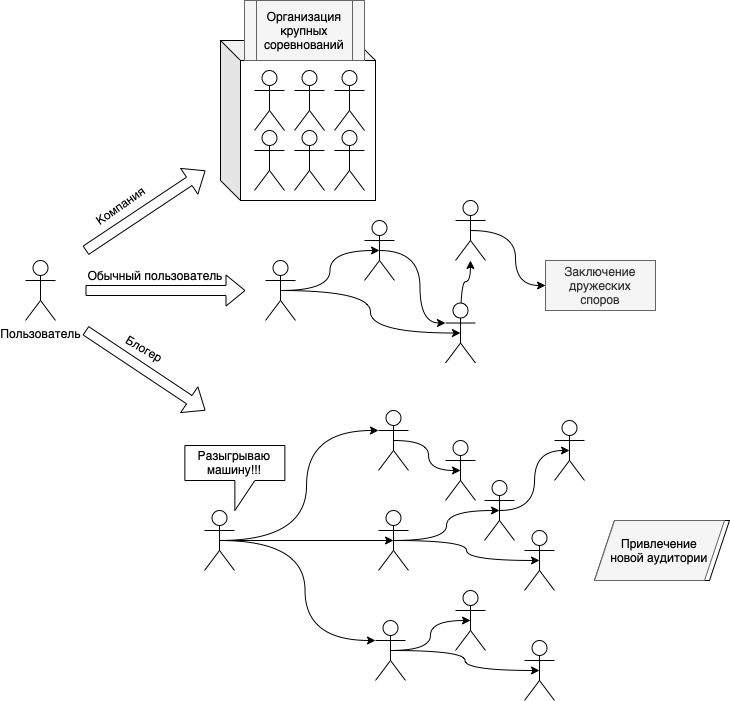
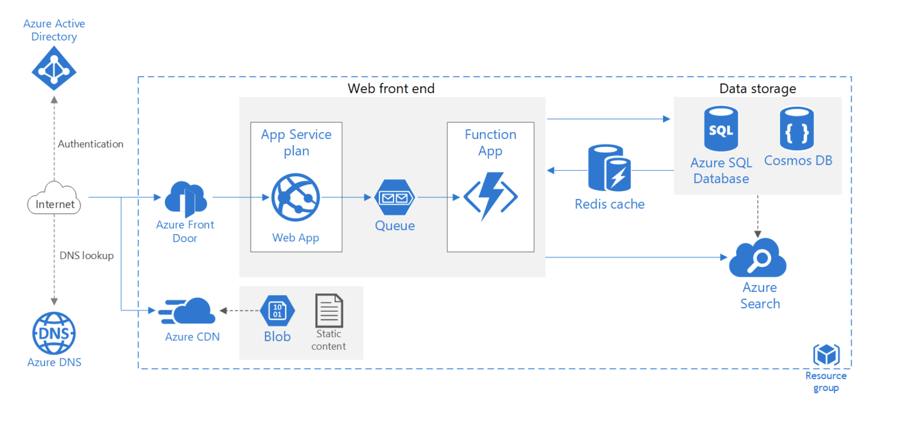

# Challengify
Приложение для участия в групповых и индивидуальных челленджах
## Доменная область
Блогеры и компании запускают челленджи, которые предполагают вовлеченность большой или средней аудитории. Целями таких акций могут являться привлечение внимания к новому продукту, повышение активности аудитории, увеличение количества подписчиков/клиентов.

### Челленджи про здоровье/саморазвитие
- NextLeveChallenge (https://nextlevelchallenge.ru/)
- #ChloeTingChallenge (https://chloeting.com/)
- Chris Heria – Do This Under 5 Min To WIN $1,000 (https://youtu.be/k8feV3iKCJY)

### Развлекательные челленджи
- #Dirolдерзкийстайл
- #PlayWithPringles
- #ЛегкийБитDanone

Большинство челленджей организуется с использованием платформ YouTube, TikTok или собственных платформ блогеров/компаний.

Для участия в челленджах очень часто необходимо выполнить ряд условий, таких как подписка на соц. Сети блогеры или иные.

Участие в большинстве челленджей бесплатное.

Челленджи проводятся с привлечением медиаконтента, преимущественно видеороликов. Видеоролики – наиболее распространенный способ участия в развлекательных челленджах, в интернет-соренованиях, связанных со спортом и саморазвитием, часто встречаются изображения и чаты, нередко таблицы.

Большинство челленджей от блогеров/компаний предполагают открытое соревнование, в котором каждый, кто участвует, может видеть результаты других участников. Часто результаты могут видеть и те, кто не участвует.
## Use-case'ы
Три пользовательские роли, разные сценарии взаимодействия с системой

## Требования к системе
### Функцинальные требования
Система должна:
- позволять пользователю завести учетную запись
- позволять пользователю войти в учетную запись
- дать пользователю возможность просматривать челленджи без регистрации
- дать пользователю возможность вступить в челлендж после регистрации
- предоставить пользователю информацию о сути челленджей и его участниках без регистрации
- обрабатывать любые запросы пользователю не более, чем за 0.1с
- отвечать требованиям безопасности данных пользователя
- хранить данные пользователя
- предоставить возможность пользователю загружать видео/фото/аудио материалы в рамках конкретного челленджа
- предоставить пользователю возможность отслеживать свой прогресс
- предоставить возможность получать “достижения” при выполнении определенных заданий
- дать возможность посмотреть работы других участников
- дать возможность пользователю изменить уровень аккаунта на “премиум” или “корпоративный”
- дать возможность создавать свои челленджи(с ограничениями)
- дать возможность создавать свои челленджи без ограничений(для “премиум” и “корпоративных” пользователей”
- предоставить возможность общаться с другими пользователями в личных и групповых чатах
### Нефункцинальные требования
- быть совместима с мобильными и десктопными устройствами
- использовать «резиновый» дизайн
- корректно работать в браузерах Chrome, Firefox, Edge
## Референсная архитектура
https://docs.microsoft.com/ru-ru/azure/architecture/reference-architectures/app-service-web-app/scalable-web-app

