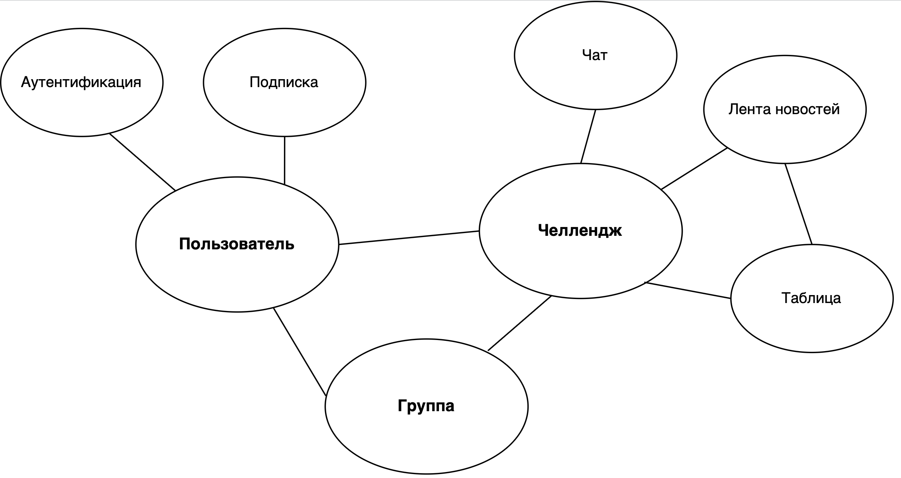
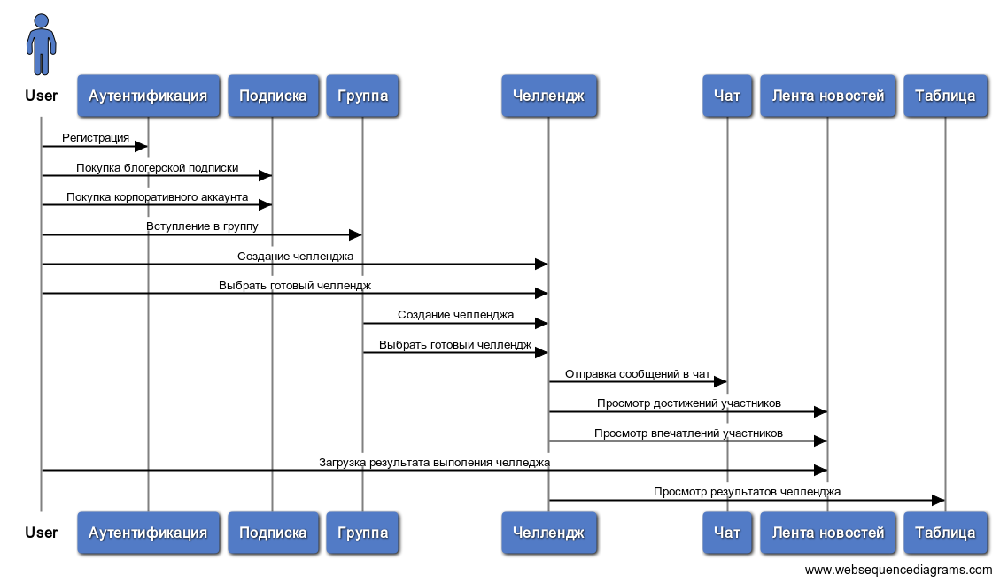

# Challengify
Веб-приложение для создания групповых и индивидуальных челленджей и участия в них. 
## Доменная область
Платформа Challengify использует подход, связанный с геймификацией и выполнением определённых задач в рамках больших или малых групп или вне группы с ограничением по времени. Приоритет отдается групповым челленджам, так именно они подчеркивают уникальность проекта, задействуют наибольшее количество функционала, вовлекают разные стороны и способствуют лучшей отдаче и более эффективной монетизации. 

Данная платформа рассчитана на большую аудиторию (более 50 000 пользователей) и средний онлайн 1500 человек. Предполагается, что платформа будет масштабироваться и обрастать дополнительным функционалом после реализации MVP. 

### В рамках приложения Challengify можно выделить следующие основные сущности:
- Челлендж – задача, имеющая временные рамки и четкие критерии измерения результата. Подразумевает участие одного или нескольких пользователей и соревновательный элемент. За каждым участником закреплен результат (в объективных единицах измерения и в единицах опыта), который отражен в общедоступной таблице.
- Группа – объединение пользователей с выделенным организатором или администраторами. Может включать в себя один челлендж или более. Имеет описание и может быть прикреплена к блогеру, компании или обычному пользователю (при создании небольшой группы). Количество участников ограничено.
- XP – индивидуальные очки опыта, полученные в рамках группы или челленджа. Отражаются в таблице и в профиле участника.
- Достижения – «ачивки», получаемые пользователем за выполнение различных задач. Видны в профиле, что способствует большей мотивации для достижения разных целей.
- Чаты для общения с участниками, знакомств, обмена опытом, достижениями и впечатлениями. 
- Лента для просмотра последних достижений всех участников и их коротких впечатлений, оценок результатов других (если это подразумевает челлендж).

### Роли пользователей платформы:
- Обычный пользователь – роль, присваиваемая по умолчанию после регистрации в приложении. Доступен индивидуальный трек, создание небольшой группы до 6 человек, вступление в созданную блогером/компанией группу.
- Блогер – роль, позволяющая создавать группы среднего размера (1000 - 5000 человек), продвигать свои социальные сети или свой продукт в рамках челленджей. Роль возможна для приобретения. Включает в себя все преимущества обычного пользователя.
- Компания – роль, позволяющая создавать группы большого размера (больше 5000 человек), продвигать свои социальные сети или свой продукт в рамках челленджей. Роль возможна для приобретения. Включает в себя все преимущества обычного пользователя и блогера.

Для наиболее эффективного взаимодействия с платформой блогеров и компаний должна быть организована техническая поддержка.

Основные виды челленджей могут быть разделены на две категории: развлекательные и связанные с саморазвитием (спортивные и другие). Для спортивных челленджей возможна интеграция с другими платформами для объективного измерения результатов участников.

При создании челленджа будут предлагаться популярные варианты уже существующих челленджей, однако можно будет создать свой собственный челлендж. Параметры челленджа должны иметь возможность гибкой настройки.

## Use-case'ы
Различные сценарии взаимодействия с системой:
- Аутентификация:
1. Пользователю показывается окно авторизации. 
2. Пользователь вводит свои данные. 
3. Пользователь нажимает на кнопку «Авторизироваться». 
4. Программа проверяет данные пользователя в системе. 
5. Если система выдает ошибку, вернуться к шагу 2. 

- Покупка блогерской подписки или корпоративного аккаунта:
1. Пользователю нажимает на кнопку «Сменить подписку». 
2. Пользователю показывается окно с выбором подписки. 
3. Пользователь выбирает нужную подписку. 
4. Пользователю показывается окно с выбором способа оплаты. 
5. Пользователь выбирает нужный способ оплаты. 
6. Пользователю показывается окно о платежной информации. 
7. Пользователь вводит свою платежную информацию. 
8. Пользователь нажимает на кнопку «Оплатить». 
9. Программа проверяет процедуру оплаты. 
10. Если система выдает ошибку, вернуться к шагу 7.

- Создание челленджа:
1. Пользователь заходит в уже существующую группу.
2. Пользователь нажимает на кнопку «создать» и появляется соответствующее всплывающее меню.
3. Пользователь вводит в поля ввода необходимую информацию (название, тип челленджа, описание, срок, участники и другое). В случае некорректного ввода поле ввода подсвечивается красным.
4. Пользователь загружает логотип челленджа или пропускает данное поле.
5. В случае ошибки возвращается к шагу 4.
6. Пользователь нажимает кнопку подтверждения.
7. В случае ошибки сервера или формата ввода в полях пользователю сообщается об этом. Происходит возврат к шагу 3 (с сохранением уже введенных данных).

- Вступление в группу блогера/компании/пользователя:
1. Пользователь переходит по публично доступной ссылке на профиль группы.
2. Пользователю показывается актуальная информация о челленджах и участниках группы.
3. Пользователь нажимает на кнопку «стать участником».
4. В случае если необходимо подтверждение заявки, пользователь ожидает вступление. В ином случае пользователь автоматически становится участником и наделяется соответствующими правами.

- Отправка сообщения в чат:
1. Пользователь открывает виджет с чатом, нажимая на соответствующую иконку, либо на уведомление.
2. Пользователь попадает в чат в начале не прочитанных сообщений или в месте, от которого пришло уведомление (в случае перехода в чат по уведомлению).
3. Пользователь использует поле ввода для написания текста сообщения.
4. Пользователь нажимает на кнопку «прикрепить файл» и загружает изображение.
5. В случае ошибки отправки сообщения или загрузки изображение пользователь возвращается к шагу 3.
6. Пользователь отправляет сообщение в чат и его видят другие участники.

- Загрузка выполнения результата челленджа:
1. Пользователь открывает соответствующее окно в случае, если оно доступно.
2. Пользователь нажимает на кнопку «загрузить файл».
3. В случае загрузки файла недопустимого формата или слишком большого файла возвращается к шагу 2.
4. Пользователь ожидает загрузки, может отслеживать прогресс.
5. Пользователь вводит краткое описание медиафайла.
6. Пользователь нажимает кнопку «опубликовать».

## Требования к системе
### Функцинальные требования
Система должна:
- позволять пользователю завести учетную запись
- позволять пользователю войти в учетную запись
- дать пользователю возможность просматривать челленджи без регистрации
- дать пользователю возможность вступить в челлендж после регистрации
- предоставить пользователю информацию о сути челленджей и его участниках без регистрации
- обрабатывать любые запросы пользователю не более, чем за 0.1с
- отвечать требованиям безопасности данных пользователя
- хранить данные пользователя
- предоставить возможность пользователю загружать видео/фото/аудио материалы в рамках конкретного челленджа
- предоставить пользователю возможность отслеживать свой прогресс
- предоставить возможность получать “достижения” при выполнении определенных заданий
- дать возможность посмотреть работы других участников
- дать возможность пользователю изменить уровень аккаунта на “премиум” или “корпоративный”
- дать возможность создавать свои челленджи(с ограничениями)
- дать возможность создавать свои челленджи без ограничений(для “премиум” и “корпоративных” пользователей”
- предоставить возможность общаться с другими пользователями в личных и групповых чатах
### Нефункцинальные требования
Система должна:
- быть совместима с мобильными и десктопными устройствами
- использовать «резиновый» дизайн

- применять не менее 60% правил material design на не менее чем 85% страницах.

- корректно работать в браузерах Chrome, Firefox, Edge

- задействовать не более трех микросервисов при обработке события

- обрабатывать исходящий от пользователя запрос за 1 секунду при нагрузке 100 онлайн пользователей

- быть недоступна не более 2 часов в год после полного введения в эксплуатацию
## Компонентная модель
Были выделены следующие основные компоненты и схема их взаимодействия с ними:

## Архитектура
Веб-приложение Challengify должно иметь микросервисную архитектуру.

Причины для её использования:
- Масштабируемость приложения
- Гибкость в разработке решения
- Популярность среди облачных решений

## Референсная архитектура
Масштабируемое веб-приложение c Event-Driven архитектурой.
Сервисы Azure, которые будут использованы:
- Azure CDN
- Azure Event Grid

https://docs.microsoft.com/ru-ru/azure/architecture/reference-architectures/app-service-web-app/scalable-web-app

